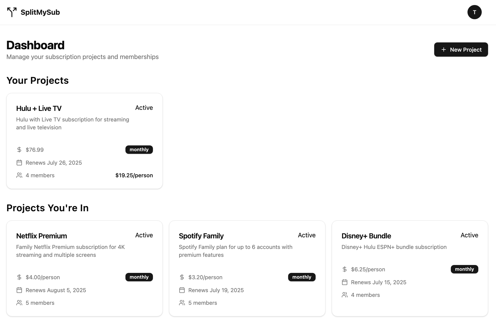
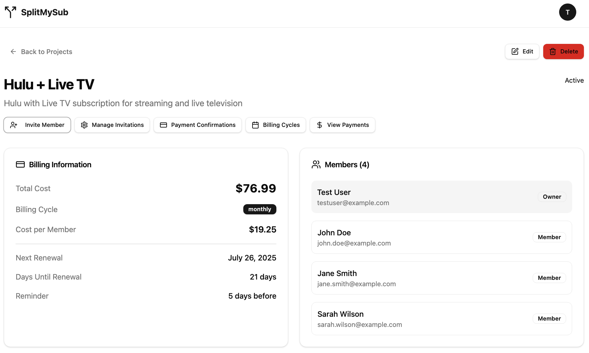
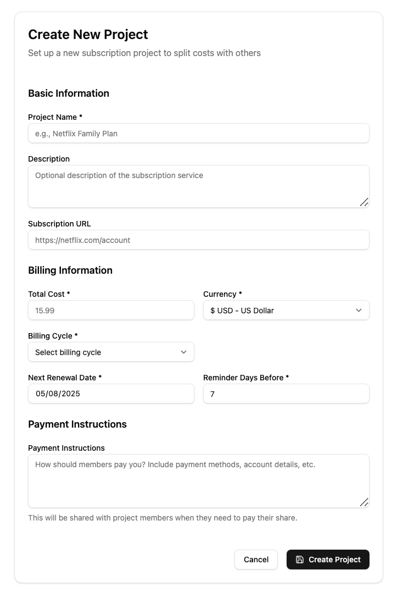
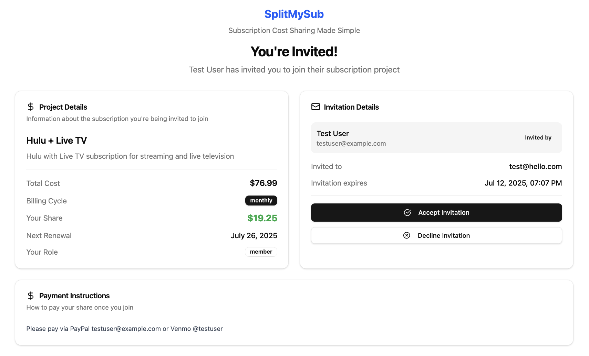
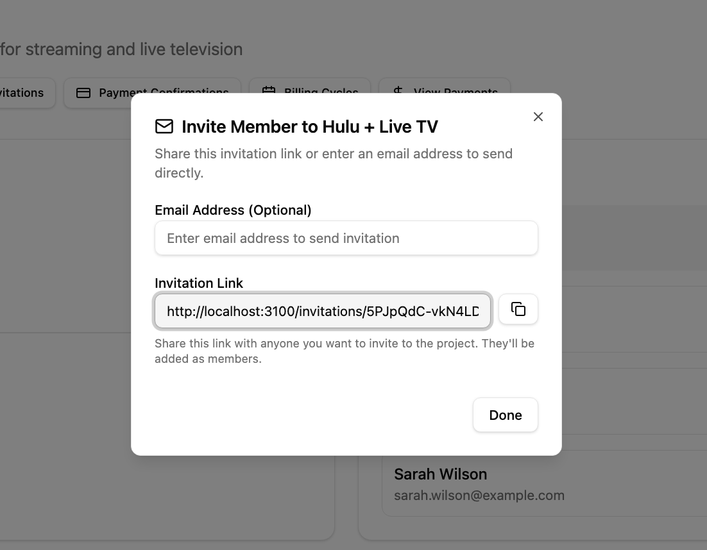
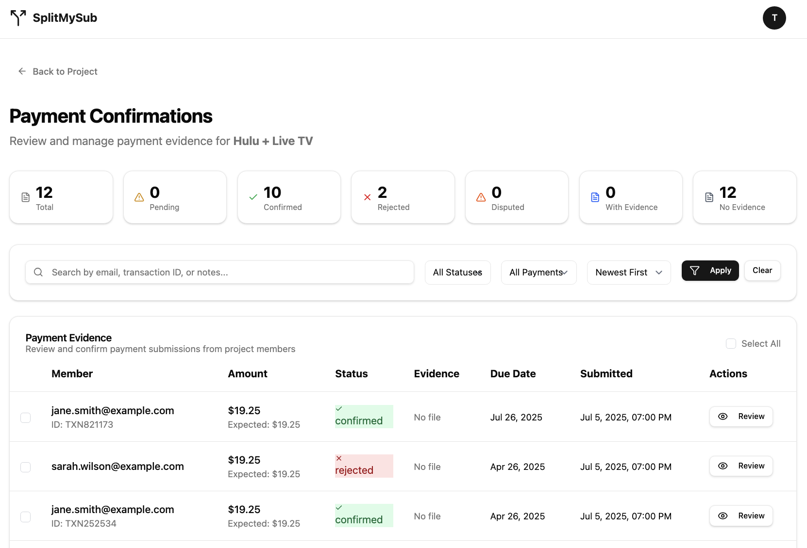
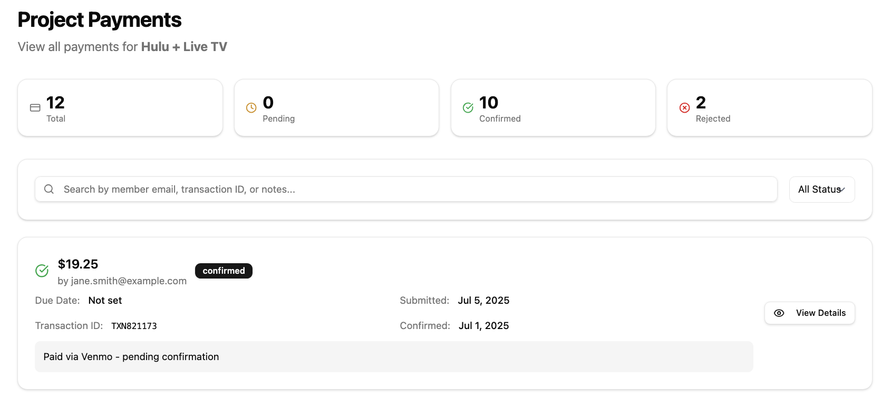

# SplitMySub

<div align="center">
  
  
  <p align="center">
    <strong>Split subscription costs effortlessly with friends, family, and colleagues</strong>
  </p>
  
  <p align="center">
    A modern Rails 8 application with Svelte frontend for managing shared subscriptions
  </p>
  
  <p align="center">
    <a href="#features">Features</a> •
    <a href="#quick-start">Quick Start</a> •
    <a href="#installation">Installation</a> •
    <a href="#documentation">Documentation</a>
  </p>
  </div>

---

## 🚀 Overview

SplitMySub is a comprehensive subscription cost-sharing platform that eliminates the hassle of manually tracking and collecting payments for shared subscriptions. Whether you're sharing Netflix with roommates, Spotify with family, or any other subscription service, SplitMySub automates the entire process.

**Built with modern technologies:**
- **Backend**: Ruby on Rails 8.0 with SQLite database
- **Frontend**: Svelte 5 with Inertia.js for seamless SPA experience
- **Styling**: Tailwind CSS with shadcn/ui components
- **Authentication**: Passwordless magic link system
- **Deployment**: Kamal for containerized deployment

## ✨ Features

### 🏠 **Project Management**
- Create and manage subscription projects (Netflix, Spotify, etc.)
- Set custom billing cycles and renewal dates
- Configure payment instructions and cost splitting
- Track project members and their payment status

### 👥 **User & Invitation System**
- **Magic Link Authentication** - No passwords required
- Email-based user invitations with expiration
- Role-based access (Project Creator vs Member)
- Seamless onboarding for new users

### 💳 **Payment Tracking**
- Upload payment evidence (receipts, screenshots, transaction IDs)
- Project creators can approve/reject payments
- Complete payment history with downloadable evidence
- Status tracking for each billing cycle

### 🔔 **Smart Reminders**
- Automated email reminders before payment due dates
- Configurable reminder timing (default: 7 days before)
- Escalating reminder sequence (gentle → follow-up → final notice)
- Customizable reminder templates

### 📊 **Dashboard & Analytics**
- Personal dashboard showing all subscriptions
- Payment obligations calendar view
- Overdue payment indicators
- Complete payment history tracking

### 🔒 **Security & Privacy**
- Secure file handling for payment evidence
- CSRF protection and security headers
- Rate limiting for sensitive endpoints
- Admin-only access controls

## 📸 Screenshots

<div align="center">
  <table>
    <tr>
      <td align="center" width="33%">
        
        <br/><strong>Project Dashboard</strong>
        <br/>Manage all your subscription projects
      </td>
      <td align="center" width="33%">
        
        <br/><strong>Create New Project</strong>
        <br/>Set up subscription sharing
      </td>
      <td align="center" width="33%">
        
        <br/><strong>Invite Members</strong>
        <br/>Send email invitations
      </td>
    </tr>
    <tr>
      <td align="center" width="33%">
        
        <br/><strong>Project Invitations</strong>
        <br/>Manage project members
      </td>
      <td align="center" width="33%">
        
        <br/><strong>Payment Tracking</strong>
        <br/>Upload and track payments
      </td>
      <td align="center" width="33%">
        
        <br/><strong>Project Payments</strong>
        <br/>View payment history
      </td>
    </tr>
  </table>
</div>

## 🚀 Quick Start

### Prerequisites
- Ruby 3.4+
- Node.js 20+
- Git

### 1. Clone and Install
```bash
git clone https://github.com/your-username/splitmysub.git
cd splitmysub
bundle install
npm install
```

### 2. Database Setup
```bash
rails db:setup
rails db:seed  # Optional: creates sample data
```

### 3. Start Development Server
```bash
bin/dev
```

Visit `http://localhost:3100` to see the application running.

## 🛠 Installation

### Local Development

```bash
# 1. Clone repository
git clone https://github.com/your-username/splitmysub.git
cd splitmysub

# 2. Install dependencies
bundle install && npm install

# 3. Setup database
rails db:create db:migrate db:seed

# 4. Start development server
bin/dev
```

### Docker Development
```bash
# Start with live reloading
docker-compose -f docker-compose.dev.yml up --build
```

Access at `http://localhost:3000` (Docker) or `http://localhost:3100` (traditional).

## ⚙️ Configuration

### Basic Environment Setup

Create a `.env` file in the project root:

```bash
# Application
APP_HOST=localhost
APP_PROTOCOL=http

# Email (required for magic links)
RESEND_API_KEY=re_xxxxxxxxxxxxxxxxxxxxxxxxxx
# OR use SMTP
SMTP_USERNAME=your-email@gmail.com
SMTP_PASSWORD=your-app-password

# Admin Access
ADMIN_PASSWORD=your-admin-password
```

**For detailed configuration including production setup, email providers, and security options, see:**
- **[Deployment Guide](docs/DEPLOYMENT.md)** - Complete environment variables reference
- **[Self-Hosting Guide](docs/SELF_HOSTING.md)** - Email configuration and security setup

## 📖 Usage

### Creating Your First Project

1. **Sign Up/Login** - Use magic link authentication
2. **Create Project** - Set up your subscription (Netflix, Spotify, etc.)
3. **Configure Details** - Set cost, billing cycle, payment instructions
4. **Invite Members** - Send email invitations to friends/family
5. **Track Payments** - Members upload payment evidence
6. **Manage Renewals** - Automated reminders handle the rest

### For Project Creators
- **Dashboard**: View all your projects and their status
- **Member Management**: Invite/remove members, track payments
- **Payment Approval**: Review and approve payment evidence

### For Project Members
- **Payment Tracking**: Upload receipts and track approval status
- **Reminder System**: Receive automated payment reminders
- **Multi-Project**: Participate in multiple subscription projects

## 🏗 Architecture

### Key Technologies
- **Rails 8**: Latest Rails with modern defaults
- **Svelte 5**: Reactive frontend framework
- **Inertia.js**: SPA experience without API complexity
- **SQLite**: Embedded database (zero configuration required)
- **Tailwind CSS**: Utility-first CSS framework
- **Kamal**: Modern deployment tool

### Project Structure
```
splitmysub/
├── app/
│   ├── controllers/           # Rails controllers
│   ├── frontend/             # Svelte frontend
│   │   ├── components/       # Reusable components
│   │   ├── pages/           # Inertia.js pages
│   │   └── lib/             # Frontend utilities
│   ├── models/              # ActiveRecord models
│   ├── services/            # Business logic
│   └── jobs/                # Background jobs
├── config/
│   ├── deploy.yml           # Kamal deployment
│   └── routes.rb            # Application routes
├── docs/                    # Documentation
└── test/                    # Test files
```

For detailed architecture information, see [docs/SYSTEM_ARCHITECTURE.md](docs/SYSTEM_ARCHITECTURE.md).

## 🧪 Testing

```bash
# Run all tests
rails test

# Run specific test files
rails test test/models/user_test.rb

# Run system tests
rails test:system
```

For comprehensive testing scenarios and manual testing procedures, see [docs/TESTING_SCENARIOS.md](docs/TESTING_SCENARIOS.md).

## 🚀 Deployment

### Production Deployment

**Quick Deploy with Kamal:**
```bash
# 1. Configure server in config/deploy.yml
# 2. Set up secrets in .kamal/secrets
bin/kamal setup
bin/kamal deploy
```

**For complete deployment instructions including:**
- Environment variables setup
- Email configuration
- Security configuration
- Troubleshooting

See **[docs/DEPLOYMENT.md](docs/DEPLOYMENT.md)**

### Self-Hosting

For complete self-hosting instructions including Docker setup, manual installation, and maintenance procedures, see **[docs/SELF_HOSTING.md](docs/SELF_HOSTING.md)**.

## 📚 Documentation

- **[Deployment Guide](docs/DEPLOYMENT.md)** - Production deployment with Kamal
- **[Self-Hosting Guide](docs/SELF_HOSTING.md)** - Complete self-hosting instructions
- **[System Architecture](docs/SYSTEM_ARCHITECTURE.md)** - Technical architecture overview
- **[Testing Scenarios](docs/TESTING_SCENARIOS.md)** - Manual testing procedures

## 🔧 Development

### Local Development Commands

```bash
# Start development server with live reloading
bin/dev

# Access Rails console
rails console

# Run database migrations
rails db:migrate

# Code quality checks
rubocop          # Linter
brakeman         # Security audit
```

## 🤝 Contributing

We welcome contributions! 

1. Fork the repository
2. Create your feature branch (`git checkout -b feature/amazing-feature`)
3. Commit your changes (`git commit -m 'Add some amazing feature'`)
4. Push to the branch (`git push origin feature/amazing-feature`)
5. Open a Pull Request

### Development Setup
```bash
git clone https://github.com/your-username/splitmysub.git
cd splitmysub
bundle install && npm install
rails db:setup
rails test
```

## 📄 License

This project is licensed under the MIT License - see the [LICENSE](LICENSE) file for details.

## 🙏 Acknowledgments

- Built with [Ruby on Rails](https://rubyonrails.org/)
- Frontend powered by [Svelte](https://svelte.dev/)
- UI components from [shadcn/ui](https://ui.shadcn.com/)
- Deployed with [Kamal](https://kamal-deploy.org/)

---

<div align="center">
  <p>Made with ❤️ for the subscription-sharing community</p>
  <p>
    <a href="https://github.com/your-username/splitmysub/issues">Report Bug</a> •
    <a href="https://github.com/your-username/splitmysub/issues">Request Feature</a>
  </p>
</div>

