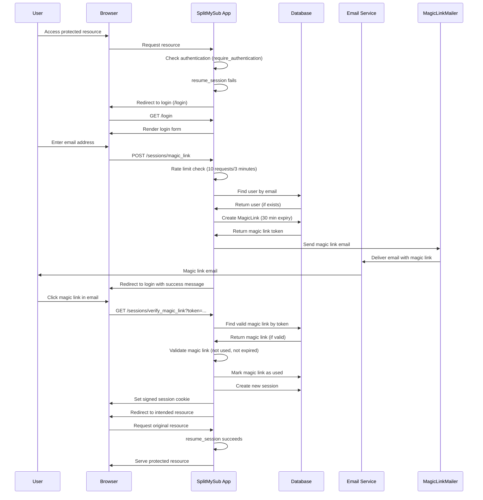
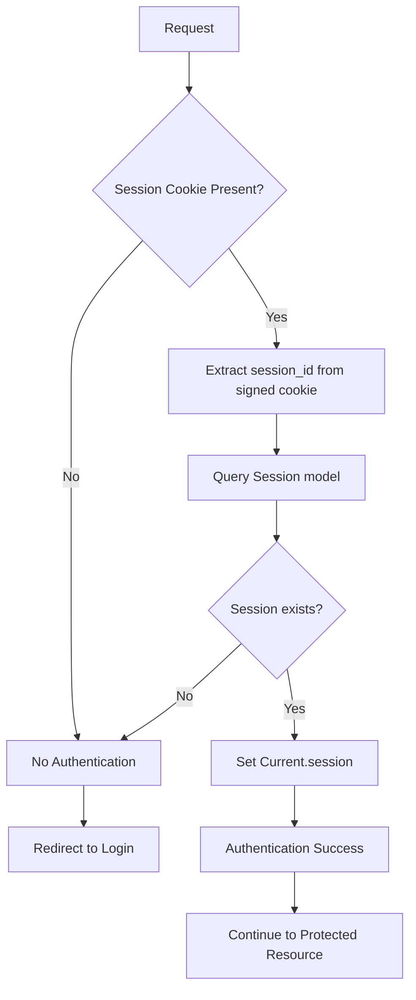
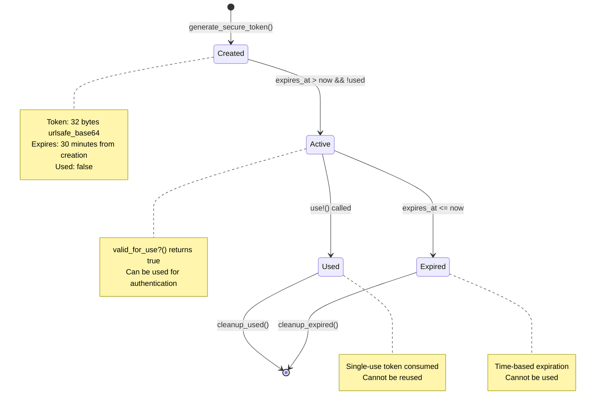
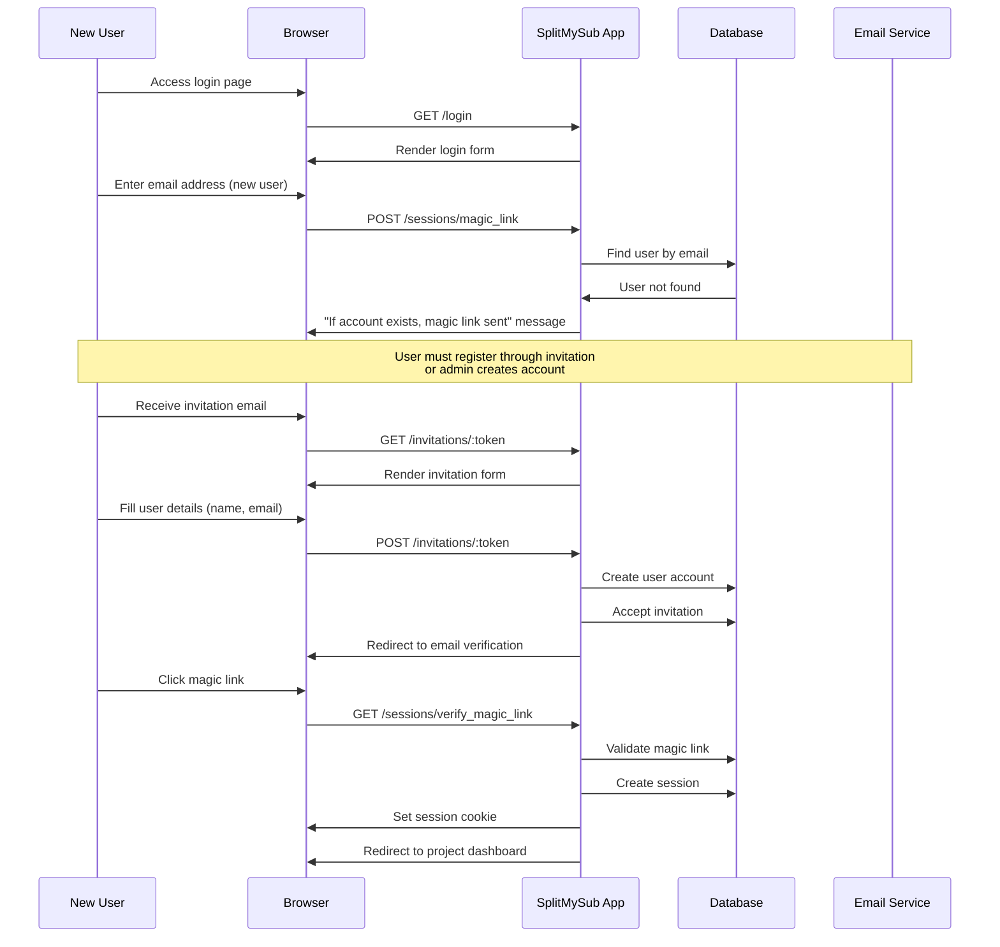
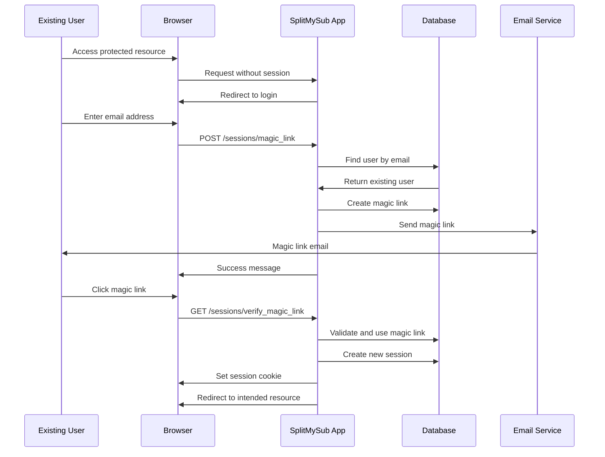
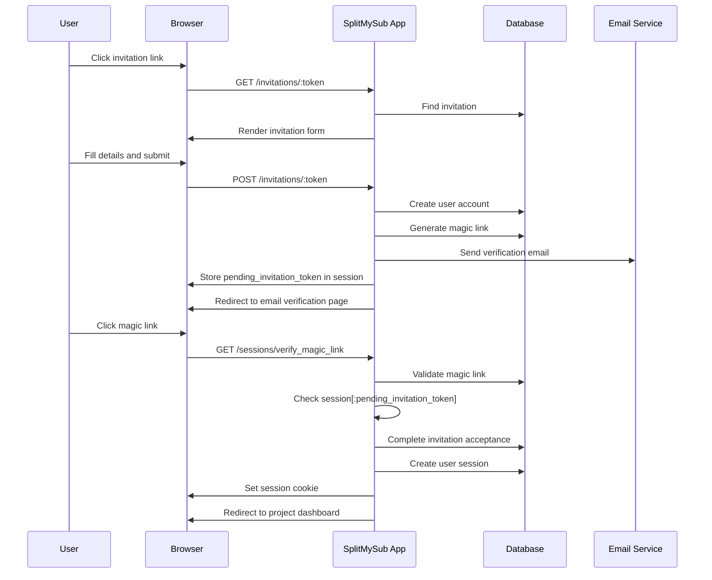

# Authentication Flow Documentation

## Overview

SplitMySub implements a passwordless authentication system using magic links, built on Rails 8's authentication framework. The system prioritizes security and user experience by eliminating passwords and using time-limited, single-use tokens sent via email.

## System Architecture

### Core Components

1. **Authentication Concern** (`app/controllers/concerns/authentication.rb`)
   - Provides session management and authentication helpers
   - Handles session resumption and authentication requirements
   - Manages authentication redirects and return URLs

2. **Magic Links Model** (`app/models/magic_link.rb`)
   - Generates secure, time-limited authentication tokens
   - Manages token lifecycle (creation, validation, expiration, cleanup)
   - Provides token validation and usage tracking

3. **User Model** (`app/models/user.rb`)
   - Core user entity with email normalization
   - Manages user sessions and associations
   - Handles user preferences and profile data

4. **Session Model** (`app/models/session.rb`)
   - Lightweight session tracking
   - Associates sessions with users
   - Enables session management across devices

5. **Sessions Controller** (`app/controllers/sessions_controller.rb`)
   - Handles login flow and magic link generation
   - Processes magic link verification
   - Manages session creation and termination

6. **Magic Link Mailer** (`app/mailers/magic_link_mailer.rb`)
   - Sends magic link emails to users
   - Formats authentication emails with expiration info

## Authentication Flow Diagrams

### 1. Magic Link Authentication Flow



### 2. Session Management Flow



### 3. Magic Link Lifecycle



## Security Features

### 1. Token Security
- **Secure Generation**: Uses `SecureRandom.urlsafe_base64(32)` for cryptographically secure tokens
- **Single Use**: Tokens are marked as used after successful authentication
- **Time-Limited**: Default 30-minute expiration with configurable duration
- **Uniqueness**: Database-level uniqueness constraint on tokens

### 2. Rate Limiting
- **Magic Link Requests**: 10 requests per 3 minutes per IP address
- **Rails 8 Native**: Uses built-in rate limiting features
- **Graceful Degradation**: Redirects with user-friendly error messages

### 3. Session Security
- **Signed Cookies**: Session IDs are cryptographically signed
- **HttpOnly**: Cookies are not accessible to JavaScript
- **SameSite**: Lax same-site policy for CSRF protection
- **Permanent**: Long-lived sessions with secure storage

### 4. Email Security
- **Timing Attack Protection**: Same response for existing/non-existing emails
- **Secure URLs**: Magic links use HTTPS in production
- **Expiration Display**: Users see exact expiration time in emails

### 5. Database Security
- **Parameterized Queries**: All database queries use parameter binding
- **Validation**: Comprehensive model validations
- **Constraints**: Database-level uniqueness constraints

## Registration Flow

### New User Registration



### Existing User Authentication



## Session Management

### Session Creation
```ruby
def start_new_session_for(user)
  user.sessions.create!(
    user_agent: request.user_agent, 
    ip_address: request.remote_ip
  ).tap do |session|
    Current.session = session
    cookies.signed.permanent[:session_id] = { 
      value: session.id, 
      httponly: true, 
      same_site: :lax 
    }
  end
end
```

### Session Resumption
```ruby
def resume_session
  Current.session ||= find_session_by_cookie
end

def find_session_by_cookie
  Session.find_by(id: cookies.signed[:session_id]) if cookies.signed[:session_id]
end
```

### Session Termination
```ruby
def terminate_session
  Current.session.destroy
  cookies.delete(:session_id)
end
```

## Integration with Invitation System

The authentication system integrates seamlessly with the invitation flow:

1. **Invitation with Email Verification**: When users accept invitations, they must verify their email through magic links
2. **Session Context**: The system maintains invitation context during authentication
3. **Secure Handoff**: Magic link verification completes invitation acceptance automatically

### Invitation Authentication Flow



## Error Handling

### Magic Link Errors
- **Invalid Token**: Redirects to login with error message
- **Expired Token**: Redirects to login with expiration message  
- **Used Token**: Redirects to login with reuse prevention message
- **Rate Limited**: Redirects with rate limit message

### Session Errors
- **Invalid Session**: Clears session and redirects to login
- **Expired Session**: Automatic cleanup and re-authentication
- **Missing Session**: Redirects to login with return URL

## Cleanup and Maintenance

### Automatic Cleanup
- **Expired Magic Links**: `MagicLink.cleanup_expired` removes expired tokens
- **Used Magic Links**: `MagicLink.cleanup_used` removes used tokens after 24 hours
- **Orphaned Sessions**: Manual cleanup of unused sessions

### Monitoring
- **Rate Limit Violations**: Logged for security monitoring
- **Authentication Failures**: Logged for audit trails
- **Session Activity**: Tracked for security analysis

## Configuration

### Magic Link Settings
- **Expiration**: 30 minutes (configurable)
- **Token Length**: 32 bytes (urlsafe_base64)
- **Rate Limit**: 10 requests per 3 minutes

### Session Settings
- **Cookie Duration**: Permanent (long-lived)
- **Security**: HttpOnly, SameSite=Lax
- **Signing**: Cryptographically signed session IDs

### Email Settings
- **Sender**: noreply@splitmysubscription.xyz
- **Template**: HTML and text versions
- **Delivery**: Immediate delivery for authentication