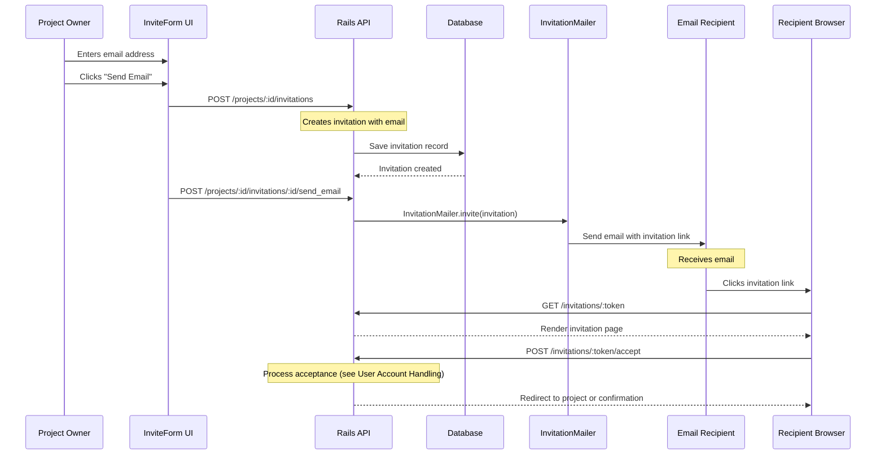
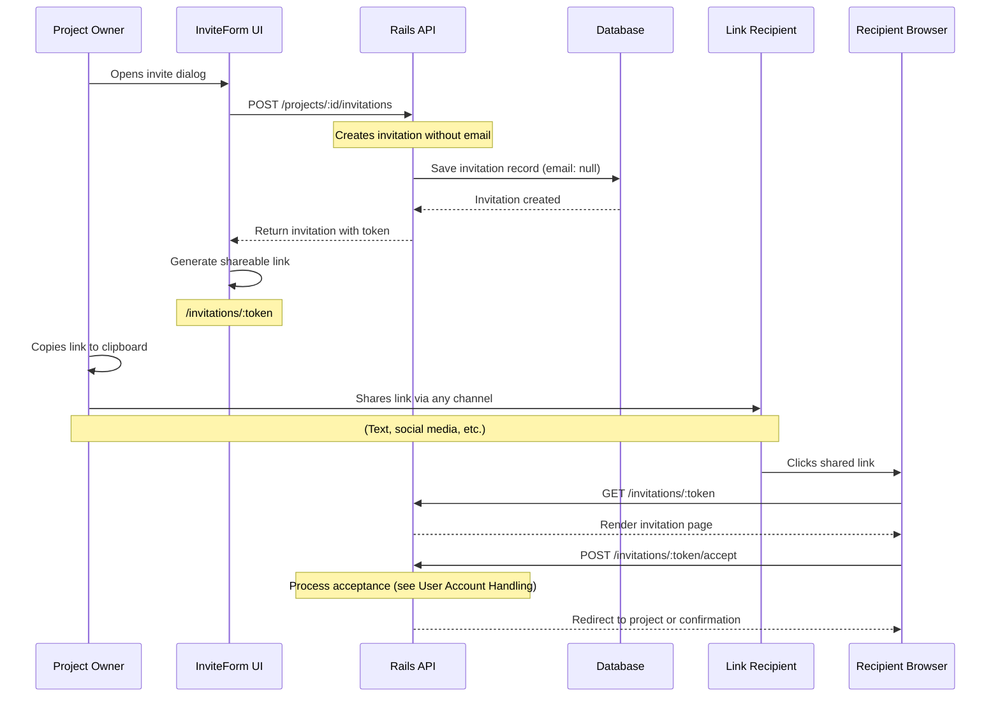
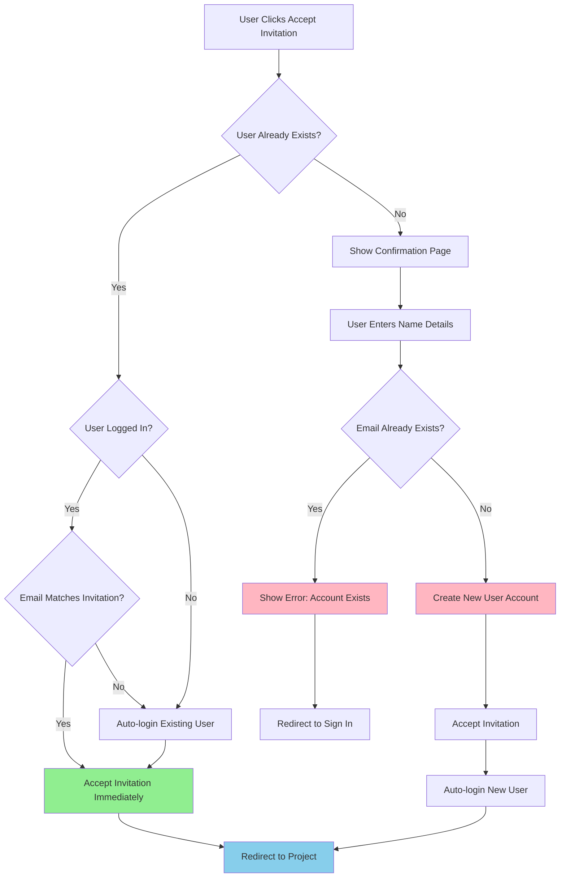

# SplitMySub Invitation System Documentation

## Overview

The SplitMySub invitation system supports two primary methods for inviting users to join subscription projects:
1. **Email Invitations** - Direct email delivery with invitation links
2. **Link Sharing** - Shareable links that can be distributed through any channel

Both methods handle new and existing users seamlessly, with automatic account creation and project membership assignment.

## System Architecture

### Core Components
- **Invitation Model** (`app/models/invitation.rb`) - Manages invitation lifecycle and validation
- **InvitationsController** (`app/controllers/invitations_controller.rb`) - Handles HTTP requests and user flows
- **InvitationMailer** (`app/mailers/invitation_mailer.rb`) - Email delivery service
- **InviteForm Component** (`app/frontend/components/invitations/InviteForm.svelte`) - UI for creating invitations
- **Invitation Pages** (`app/frontend/pages/invitations/`) - User-facing invitation interface

---

## Email Invitation Flow



### Email Invitation Process Steps

1. **Invitation Creation**
   - Owner enters email address in `InviteForm.svelte`
   - Form submits to `POST /projects/:project_id/invitations`
   - Creates `Invitation` record with email, token, and 7-day expiration

2. **Email Delivery**
   - Separate API call to `POST /projects/:project_id/invitations/:id/send_email`
   - `InvitationMailer.invite()` sends email with invitation link
   - Email includes project details and personalized message

3. **Recipient Access**
   - Recipient clicks link in email
   - Navigates to `/invitations/:token` (public route)
   - Views invitation details and project information

4. **Acceptance Processing**
   - User clicks "Accept Invitation"
   - Routes to user account handling logic (see below)

---

## Link Sharing Flow



### Link Sharing Process Steps

1. **Link Generation**
   - Owner opens invite dialog in `InviteForm.svelte`
   - Automatic API call to `POST /projects/:project_id/invitations` without email
   - Creates `Invitation` record with `email: null`
   - UI generates shareable link: `/invitations/:token`

2. **Link Distribution**
   - Owner copies link using copy button
   - Shares via any channel (text, social media, Slack, etc.)
   - No email delivery required

3. **Recipient Access**
   - Anyone with link can access invitation page
   - Same invitation page as email flow
   - If no email associated, prompts for email during confirmation

4. **Acceptance Processing**
   - Routes to user account handling logic

---

## User Account Handling Decision Tree



### User Account Scenarios

#### Scenario 1: Existing User, Logged In, Matching Email
```ruby
# invitations_controller.rb:157
if authenticated? && Current.user.email_address == @invitation.email
  @invitation.accept!(Current.user)
  redirect_to project_path(@invitation.project)
end
```

#### Scenario 2: Existing User, Not Logged In
```ruby
# invitations_controller.rb:176
existing_user = User.find_by(email_address: @invitation.email)
@invitation.accept!(existing_user)
start_new_session_for(existing_user)  # Auto-login
redirect_to project_path(@invitation.project)
```

#### Scenario 3: New User (Email Invitation)
```ruby
# invitations_controller.rb:278 - Email already verified
user = User.create!(email_address: user_email, ...)
@invitation.accept!(user)
start_new_session_for(user)
redirect_to project_path(@invitation.project)
```

#### Scenario 4: New User (Link Invitation) - **SECURE FLOW**
```ruby
# invitations_controller.rb:264 - Requires email verification
user = User.create!(email_address: user_email, ...)
session[:pending_invitation_token] = @invitation.token
magic_link = MagicLink.generate_for_user(user, expires_in: 30.minutes)
MagicLinkMailer.send_magic_link(user, magic_link).deliver_now
# Shows email verification page - invitation completed after email verification
```

---

## Technical Implementation Details

### Invitation Model (`app/models/invitation.rb`)

#### Key Attributes
- `email` - Recipient email (nullable for link-only invitations)
- `token` - Secure URL-safe token for invitation links
- `status` - `pending`, `accepted`, `declined`, `expired`
- `role` - Always `member` (security constraint)
- `expires_at` - 7-day expiration from creation
- `invited_by` - Reference to inviting user
- `project` - Reference to target project

#### Security Features
```ruby
# Prevent duplicate invitations
validates :email, uniqueness: { scope: :project_id }

# Prevent inviting existing members
validate :email_not_already_member
validate :email_not_project_owner

# Token security
generates_token_for :invitation, expires_in: 7.days
before_validation :generate_secure_token, on: :create
```

#### Business Logic Methods
```ruby
def accept!(user)
  transaction do
    project.project_memberships.create!(user: user, role: role)
    update_columns(status: "accepted", expires_at: Time.current)
  end
end

def expired?
  expires_at < Time.current || status == "expired"
end
```

### InvitationsController Key Methods

#### Public Routes (No Authentication Required)
- `GET /invitations/:token` - View invitation page
- `POST /invitations/:token/accept` - Accept invitation
- `POST /invitations/:token/confirm` - Confirm new user account
- `POST /invitations/:token/decline` - Decline invitation

#### Protected Routes (Owner Only)
- `GET /projects/:id/invitations` - List project invitations
- `POST /projects/:id/invitations` - Create new invitation
- `PATCH /projects/:id/invitations/:id` - Update invitation
- `POST /projects/:id/invitations/:id/send_email` - Send invitation email
- `DELETE /projects/:id/invitations/:id` - Cancel invitation

### Frontend Components

#### InviteForm.svelte Features
- **Dual Mode**: Email + Link generation in single dialog
- **Auto-generation**: Creates invitation link on dialog open
- **Copy Functionality**: One-click link copying
- **Email Integration**: Optional email sending
- **Validation**: Real-time email format validation

#### Invitation Pages
- `show.svelte` - Main invitation display page
- `confirm.svelte` - New user account creation form
- `expired.svelte` - Expired invitation message
- `declined.svelte` - Decline confirmation page

### Email Integration

#### InvitationMailer
```ruby
def invite(invitation)
  @invitation = invitation
  @project = invitation.project
  @invited_by = invitation.invited_by
  @invitation_url = invitation_url(@invitation.token)
  
  mail(
    to: @invitation.email,
    subject: "You're invited to join #{@project.name} on SplitMySub",
    reply_to: @invited_by.email_address
  )
end
```

#### Email Templates
- HTML and text versions available
- Personalized with inviter details
- Includes project information and invitation link
- Professional branding and clear call-to-action

---

## Error Handling & Edge Cases

### Race Conditions
- **Concurrent User Creation**: Handles multiple simultaneous account creation attempts
- **Database Constraints**: Catches unique constraint violations
- **Token Validation**: Prevents token reuse and manipulation

### Security Measures
- **Token Expiration**: 7-day automatic expiration
- **Role Restriction**: Only `member` role allowed (no admin escalation)
- **Member Validation**: Prevents duplicate invitations to existing members
- **Owner Protection**: Cannot invite project owner
- **Email Verification**: Link-only invitations require email verification to prevent impersonation

### Security Fix Implementation
The original link sharing flow had a vulnerability where users could enter any email address and immediately gain access to projects. This has been fixed with the following approach:

#### Before (Vulnerable)
```ruby
# Anyone could enter any email and gain immediate access
user = User.create!(email_address: params[:email], ...)
@invitation.accept!(user)  # IMMEDIATE ACCESS - NO VERIFICATION
start_new_session_for(user)
```

#### After (Secure)
```ruby
# Email verification required for link-only invitations
if @invitation.email.blank?  # Link-only invitation
  user = User.create!(email_address: params[:email], ...)
  session[:pending_invitation_token] = @invitation.token
  magic_link = MagicLink.generate_for_user(user, expires_in: 30.minutes)
  MagicLinkMailer.send_magic_link(user, magic_link).deliver_now
  # User must verify email before invitation is accepted
else  # Email-specific invitation
  # Email already verified by being sent to that address
  @invitation.accept!(user)
  start_new_session_for(user)
end
```

This ensures that:
1. **Email-specific invitations** work as before (email already verified)
2. **Link-only invitations** require email verification
3. **No impersonation** is possible via shared links
4. **Consistent UX** with existing sign-up flow

### User Experience
- **Expired Invitations**: Clear messaging with contact information
- **Invalid Tokens**: Graceful handling with redirect to home
- **Email Validation**: Real-time validation with helpful error messages
- **Success Feedback**: Clear confirmation of actions taken

---

## Configuration & Maintenance

### Cleanup Tasks
```ruby
# lib/tasks/invitations.rake
task cleanup: :environment do
  Invitation.expire_old_invitations!
end
```

### Monitoring
- Track invitation acceptance rates
- Monitor expired invitations
- Log security events (invalid tokens, etc.)

### Testing
Comprehensive test coverage in:
- `test/models/invitation_test.rb`
- `test/controllers/invitations_controller_test.rb`
- `test/integration/invitation_flow_test.rb`
- `test/mailers/invitation_mailer_test.rb`

---

## Future Enhancements

### Potential Improvements
1. **Bulk Invitations** - Multiple email addresses at once
2. **Invitation Templates** - Customizable invitation messages
3. **Role-based Invitations** - Different permission levels
4. **Usage Analytics** - Track invitation success rates
5. **Integration APIs** - Slack, Teams, etc. integration
6. **Reminder System** - Follow-up emails for pending invitations