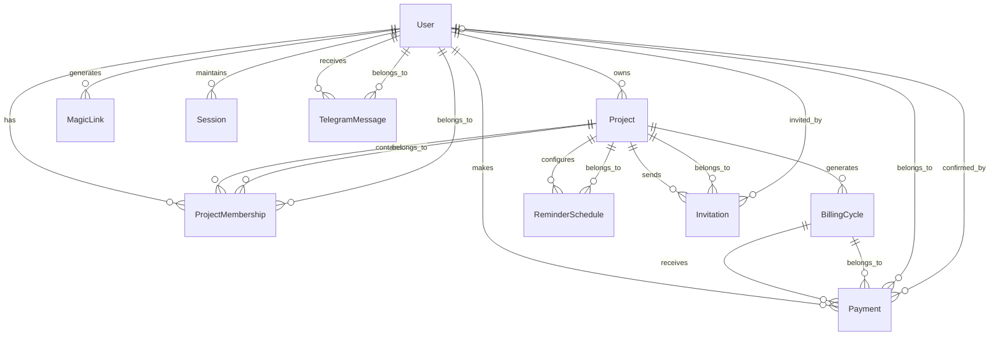

# SplitMySub System Architecture

A comprehensive guide to the system architecture of SplitMySub, a Rails 8 application for managing shared subscription costs with Svelte frontend components.

## 🏗️ Architecture Overview

SplitMySub follows a modern Rails architecture pattern with clear separation of concerns, leveraging Rails 8 features with a Svelte frontend via Inertia.js for a seamless single-page application experience.

### **Core Architecture Principles**
- **Convention over Configuration**: Leverages Rails conventions for rapid development
- **Single Responsibility**: Each component has a clear, focused purpose
- **Secure by Default**: Built-in security patterns and authentication
- **Scalable Design**: SQLite for simplicity, easy migration path to PostgreSQL

---

## 🗄️ Database Architecture

### **Database Schema Overview**

SplitMySub uses **SQLite** as the primary database for simplicity and zero-configuration deployment. The schema is designed around subscription cost splitting with clear entity relationships.

#### **Core Entities**



#### **Entity Relationships**

1. **User** (Central entity)
   - **Owns** multiple projects
   - **Participates** in projects via ProjectMembership
   - **Makes** payments for billing cycles
   - **Authenticates** via magic links

2. **Project** (Subscription container)
   - **Belongs to** a user (owner)
   - **Contains** multiple members via ProjectMembership
   - **Generates** billing cycles automatically
   - **Sends** invitations to new members

3. **BillingCycle** (Payment period)
   - **Belongs to** a project
   - **Receives** payments from members
   - **Tracks** payment status and amounts

4. **Payment** (Transaction record)
   - **Belongs to** a billing cycle and user
   - **Contains** evidence attachments
   - **Tracks** confirmation status

### **Key Database Features**

#### **SQLite Optimizations**
```sql
-- Optimized pragmas for production
PRAGMA journal_mode = WAL;        -- Better concurrency
PRAGMA synchronous = NORMAL;      -- Performance/safety balance
PRAGMA temp_store = MEMORY;       -- Faster temporary operations
PRAGMA cache_size = -2000;       -- 2MB cache
```

#### **Currency Support**
- **Multi-currency** support via `CurrencySupport` concern
- **30+ currencies** with proper formatting and localization
- **Per-project** currency settings with automatic conversion display

#### **Flexible Billing Cycles**
- **Configurable frequencies**: Daily, weekly, monthly, quarterly, yearly
- **Dynamic billing** via `BillingConfig` singleton
- **Automatic generation** of future billing cycles

---

## 🔧 Service Layer Architecture

### **Service Object Pattern**

SplitMySub implements service objects for complex business logic, keeping controllers thin and models focused on data relationships.

#### **Core Services**

1. **Core Business Services**
   - `ReminderService` - Processes payment reminders and escalation
   - `BillingCycleGeneratorService` - Generates billing cycles automatically
   - `BillingCycleManager` - Manages billing cycle lifecycle
   - `TelegramBotService` - Handles Telegram bot interactions
   - `ErrorNotificationService` - Centralized error handling and notification

2. **Email and Notification Services**
   - `MagicLinkMailer` - Authentication emails
   - `ReminderMailer` - Payment reminder emails with escalation levels
   - `PaymentConfirmationJob` - Asynchronous payment notifications
   - `ReminderMailerJob` - Background job for sending reminder emails
   - `TelegramNotificationJob` - Telegram notifications
   - `TelegramNotificationService` - Formats and sends Telegram messages

3. **Background Jobs**
   ```ruby
   # Asynchronous payment processing
   PaymentConfirmationJob.perform_later(payment_id)
   
   # Payment reminder emails
   ReminderMailerJob.perform_later(billing_cycle_id: cycle.id, user_id: user.id)
   
   # Telegram notifications
   TelegramNotificationJob.perform_later(notification_params)
   
   # Billing cycle generation
   BillingCycleGeneratorJob.perform_later
   ```

### **Query Object Pattern**

Complex database queries are encapsulated in dedicated query objects:

```ruby
# Example query patterns
DuePaymentsQuery.call(days_before: 3)
UserProjectsQuery.call(user, role: :owner)
UpcomingBillingCyclesQuery.call(project, months_ahead: 3)
```

### **Configuration Management**

**BillingConfig** singleton pattern manages system-wide billing settings:

```ruby
config = BillingConfig.current
config.supported_billing_frequencies  # ["monthly", "quarterly", "yearly"]
config.generation_months_ahead         # 3
config.reminder_schedule              # [7, 3, 1]
```

---

## 🎨 Frontend Architecture

### **Svelte + Inertia.js Integration**

SplitMySub uses **Inertia.js** to bridge Rails and Svelte, providing SPA-like experience without API complexity.

#### **Component Structure**

```
app/frontend/
├── entrypoints/
│   └── application.js          # Main entry point
├── components/
│   ├── ui/                     # Reusable UI components
│   ├── forms/                  # Form components
│   ├── layout/                 # Layout components
│   └── shared/                 # Shared utilities
└── pages/                      # Inertia page components
    ├── dashboard/
    ├── projects/
    ├── payments/
    └── sessions/
```

#### **State Management**

**Svelte Stores** for global state:

```javascript
// User authentication state
export const userStore = writable(null);

// Project context state
export const projectStore = writable(null);

// Flash message state
export const flashStore = writable({ notice: null, alert: null });
```

#### **Component Communication**

1. **Props Down**: Data flows from parent to child components
2. **Events Up**: Child components emit events to parents
3. **Stores**: Global state for cross-component communication
4. **Inertia**: Page-level data from Rails controllers

---

## 🔌 API Design

### **Inertia.js Endpoints**

SplitMySub uses Inertia.js for seamless Rails-Svelte communication, eliminating traditional REST API complexity.

#### **Controller Architecture**

```ruby
class ProjectsController < ApplicationController
  def index
    render inertia: "projects/Index", props: {
      projects: @projects.map { |p| project_json(p) },
      user_permissions: user_permissions
    }
  end
end
```

#### **Key Endpoints**

| Endpoint | Method | Purpose | Inertia Component |
|----------|--------|---------|-------------------|
| `/dashboard` | GET | User dashboard | `dashboard/Index` |
| `/projects` | GET/POST | Project management | `projects/Index` |
| `/projects/:id` | GET/PATCH | Project details | `projects/Show` |
| `/projects/:id/payments` | GET/POST | Payment management | `payments/Index` |
| `/billing_cycles` | GET/POST | Billing cycle management | `billing_cycles/Index` |
| `/invitations/:token` | GET/POST | Invitation handling | `invitations/Show` |

#### **Data Serialization**

Consistent JSON serialization patterns:

```ruby
def project_json(project)
  {
    id: project.id,
    slug: project.slug,
    name: project.name,
    cost: project.cost,
    currency: project.currency,
    cost_per_member: project.cost_per_member,
    total_members: project.total_members,
    is_owner: project.is_owner?(Current.user),
    days_until_renewal: project.days_until_renewal
  }
end
```

---

## 🔐 Security Architecture

### **Authentication System**

**Magic Link Authentication** provides secure, passwordless access:

```ruby
# Magic link generation
magic_link = MagicLink.generate_for_user(user, expires_in: 30.minutes)

# Token validation
magic_link = MagicLink.find_valid_token(token)
magic_link.use! if magic_link&.valid_for_use?
```

#### **Security Features**
- **Token Expiration**: 30-minute expiry for magic links
- **Single Use**: Tokens invalidated after use
- **Rate Limiting**: Hybrid approach using both Rack::Attack (middleware-level) and Rails 8 native rate limiting (controller-specific)
- **Secure Generation**: `SecureRandom.urlsafe_base64(32)`
- **Email Verification**: Magic link verification for invitation security
- **Audit Logging**: Security event logging for invitation and authentication flows

### **Authorization System**

**Role-Based Access Control** via `Authorization` concern:

```ruby
# Project access levels
- Owner: Full project management, payment confirmation
- Member: View project, make payments, limited access

# Payment access levels  
- Payment Owner: Create, update own payments
- Project Owner: Confirm, reject all payments
- Project Members: View payment status
```

#### **Security Headers**

```ruby
# CSRF Protection
protect_from_forgery with: :exception

# Secure file downloads
response.headers["X-Content-Type-Options"] = "nosniff"
response.headers["X-Frame-Options"] = "DENY"
response.headers["Cache-Control"] = "private, no-cache"
```

### **File Upload Security**

**Payment Evidence** handling with security controls:

```ruby
# File type validation
allowed_types = %w[image/png image/jpg image/jpeg image/heic application/pdf]

# File size limits
validates :evidence, file_size: { less_than: 5.megabytes }

# Secure file serving
send_secure_file(attachment) # With sanitized filenames
```

---

## 🚀 Deployment Architecture

### **Kamal Deployment**

SplitMySub uses **Kamal** for modern, zero-downtime deployments with Docker containers.

#### **Infrastructure Components**

```yaml
# config/deploy.yml
service: splitmysub
image: splitmysub

servers:
  web:
    - your-server-ip

registry:
  server: ghcr.io
  username: your-username

volumes:
  - "splitmysub_storage:/rails/storage"
  - "splitmysub_db:/rails/db"
```

#### **Container Architecture**

```dockerfile
# Optimized for Rails 8 + Svelte
FROM ruby:3.4.4-alpine

# SQLite database volume
VOLUME ["/rails/db"]

# File storage volume  
VOLUME ["/rails/storage"]

# Health check endpoint
HEALTHCHECK --interval=30s --timeout=3s --start-period=5s \
  CMD curl -f http://localhost:3000/health || exit 1
```

### **Environment Configuration**

#### **Required Environment Variables**

```bash
# Application
SECRET_KEY_BASE=<secure-secret>
RAILS_ENV=production

# Email (choose one)
RESEND_API_KEY=<resend-key>
# OR
SMTP_USERNAME=<smtp-user>
SMTP_PASSWORD=<smtp-pass>

# Security (optional)
CLOUDFLARE_TURNSTILE_SECRET_KEY=<turnstile-key>
```

#### **SQLite Configuration**

```yaml
# config/database.yml
production:
  adapter: sqlite3
  database: db/production.sqlite3
  pool: <%= ENV.fetch("RAILS_MAX_THREADS") { 5 } %>
  timeout: 5000
  pragmas:
    journal_mode: wal
    synchronous: normal
    temp_store: memory
    cache_size: -2000
```

---

## 📊 Performance Architecture

### **Caching Strategy**

#### **Application-Level Caching**
```ruby
# Fragment caching for expensive views
<% cache [@project, "member_list"] do %>
  <%= render "members" %>
<% end %>

# Query result caching
Rails.cache.fetch("user_#{user.id}_projects", expires_in: 1.hour) do
  user.all_projects.includes(:members)
end
```

#### **Database Optimization**
```ruby
# Eager loading to prevent N+1 queries
@projects = Current.user.projects
                        .includes(:project_memberships, :members, :billing_cycles)

# Scoped queries for performance
scope :with_recent_payments, -> { 
  joins(:payments).where(payments: { created_at: 1.month.ago.. })
}
```

### **Background Processing**

**SolidQueue** for asynchronous job processing:

```ruby
# config/schedule.rb
every 1.day, at: '6:00 am' do
  runner "BillingCycleGeneratorJob.perform_later"
end

every 1.day, at: '9:00 am' do
  runner "ReminderService.process_all_reminders"
end

every 1.hour do
  runner "MagicLink.cleanup_expired"
end
```

---

## 🔍 Monitoring & Observability

### **Health Checks**

Built-in health check endpoint:

```ruby
# config/routes.rb
get '/health', to: 'health#index'

# Health check includes:
- Database connectivity
- Disk space
- Memory usage
- Background job queue status
```

### **Error Handling**

**Comprehensive error handling** with context:

```ruby
# app/controllers/application_controller.rb
rescue_from StandardError, with: :handle_standard_error

def handle_standard_error(exception)
  ErrorNotificationService.notify_critical_error(exception, {
    controller: self.class.name,
    action: action_name,
    user_id: Current.user&.id,
    params: params.to_unsafe_h.except("password")
  })
end
```

### **Logging Strategy**

```ruby
# Structured logging
Rails.logger.info "Payment confirmed", {
  payment_id: payment.id,
  user_id: user.id,
  amount: payment.amount,
  project_id: payment.project.id
}
```

---

## 🧪 Testing Architecture

### **Test Structure**

```
test/
├── models/                     # Model unit tests
├── controllers/               # Controller integration tests
├── system/                    # End-to-end system tests
├── jobs/                      # Background job tests
├── mailers/                   # Email tests
└── fixtures/                  # Test data
```

### **Testing Patterns**

#### **Model Tests**
```ruby
# test/models/project_test.rb
test "calculates cost per member correctly" do
  project = projects(:netflix)
  assert_equal 4.99, project.cost_per_member
end
```

#### **System Tests**
```ruby
# test/system/payment_flow_test.rb
test "user can make payment with evidence" do
  visit project_path(@project)
  click_on "Make Payment"
  attach_file "Evidence", file_fixture("receipt.pdf")
  click_on "Submit Payment"
  
  assert_text "Payment submitted successfully"
end
```

---

## 📈 Scalability Considerations

### **Current Architecture Limits**

- **SQLite**: Suitable for small to medium teams (< 100 concurrent users)
- **Single Server**: Kamal deployment to single server
- **File Storage**: Local storage for payment evidence

### **Scaling Path**

#### **Database Migration**
```ruby
# Future PostgreSQL migration
# 1. Export SQLite data
# 2. Update database.yml
# 3. Import to PostgreSQL
# 4. Update deployment configuration
```

#### **Horizontal Scaling**
```yaml
# config/deploy.yml - Multiple servers
servers:
  web:
    - web-1.example.com
    - web-2.example.com
  
accessories:
  db:
    image: postgres:15
    host: db.example.com
```

#### **External Services**
- **File Storage**: AWS S3 for payment evidence
- **Email**: External SMTP or email service
- **Caching**: Redis for session storage and caching
- **Background Jobs**: Dedicated job processing servers

---

## 🛠️ Development Workflow

### **Local Development Setup**

```bash
# 1. Clone and setup
git clone <repository>
cd splitmysub
bin/setup

# 2. Database setup
bin/rails db:create db:migrate db:seed

# 3. Install frontend dependencies
npm install

# 4. Start development server
bin/dev
```

### **Code Organization**

#### **Rails Conventions**
- **Models**: Business logic and data relationships
- **Controllers**: Request handling and response formatting
- **Views**: Inertia.js page components (Svelte)
- **Services**: Complex business operations
- **Jobs**: Background processing
- **Mailers**: Email generation

#### **Frontend Conventions**
- **Pages**: Top-level Inertia components
- **Components**: Reusable UI components
- **Stores**: Global state management
- **Utils**: Helper functions and utilities

---

## 📚 Additional Resources

### **Key Documentation**
- [README.md](../README.md) - Project overview and setup
- [DEPLOYMENT.md](./DEPLOYMENT.md) - Production deployment guide
- [EMAIL_CONFIGURATION.md](./EMAIL_CONFIGURATION.md) - Email setup
- [SELF_HOSTING.md](./SELF_HOSTING.md) - Self-hosting guide

### **External Dependencies**
- **Rails 8**: Web application framework
- **Svelte**: Frontend component framework
- **Inertia.js**: Rails-Svelte bridge
- **SQLite**: Database engine
- **Kamal**: Deployment tool
- **Tailwind CSS**: Utility-first CSS framework

### **Development Tools**
- **Rails Console**: `bin/rails console`
- **Database Console**: `bin/rails dbconsole`
- **Log Monitoring**: `tail -f log/development.log`
- **Testing**: `bin/rails test` and `bin/rails test:system`

---

This architecture documentation provides a comprehensive overview of SplitMySub's system design. The architecture balances simplicity with scalability, using modern Rails patterns while maintaining clear separation of concerns and security best practices. 